# Twinkle Ling

<!-- Table of Contents -->
## Table of Contents
<ul dir="auto">
<li><a href="#description">Description</a></li>
<li><a href="#built-with">Built With</a></li>
<li><a href="#demo">Demonstration</a></li>
<li><a href="#usage">Usage</a></li>
</ul>

## Description
<!-- Description goes here -->

Twinkle Ling is a language flashcard application that allows users to create, organize, and study flashcard decks. They can track their daily and weekly progress and choose between multiple study modes for each study session. See "How To Use" below for details on current functionality.

More functionality is on the way, so please check back soon!
Soon to be added: audio upload and replay, image upload, public deck and user search, user profile editing and visiting, and deck sharing.

## Built With
<!-- Built With -->

 

## Demonstration
<video controls="controls" width="800" height="600" name="Twinkle Ling Demo">
  <source src="https://www.youtube.com/watch?v=oahboXw4BH4">
</video>

## Usage

### Dashboard
Users can log in and see their user dashboard, which shows their weekly progress, recently used flashcard decks, and trending decks. 
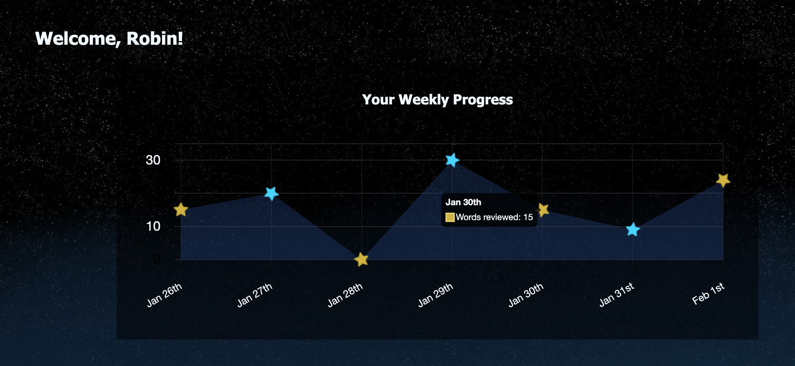
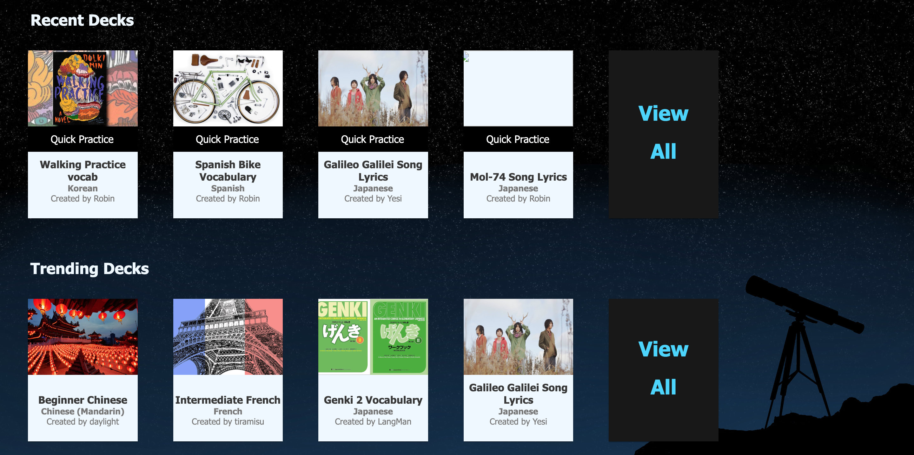

### Decks
Users can view details of flashcard decks they use by clicking the chosen deck anywhere but the center 'Quick Study' banner. 
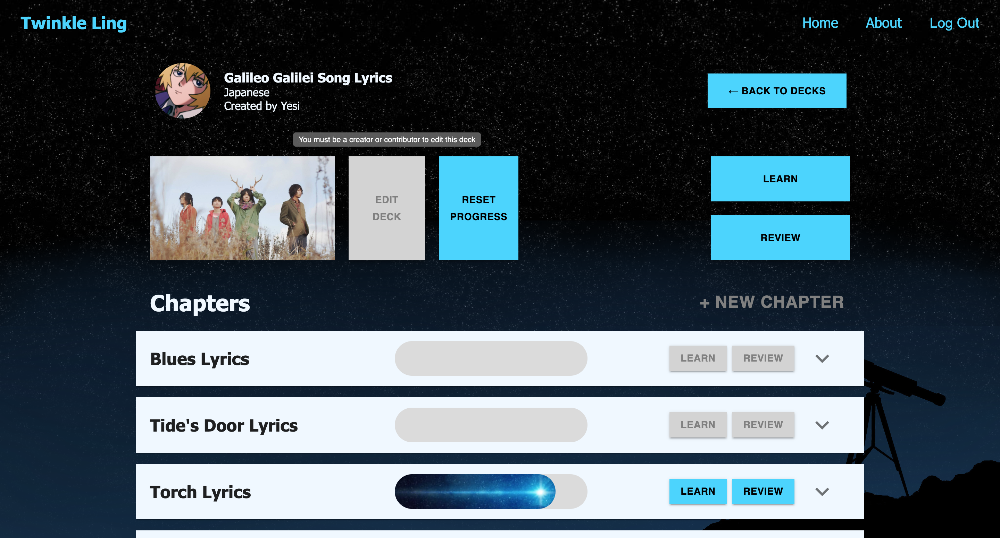

On the details page, each chapter has a progress bar to show progress towards chapter completion, and each chapter can be expanded to show the words it contains. A deck requires a minimum of 1 chapter, but a chapter can contain any number of words.
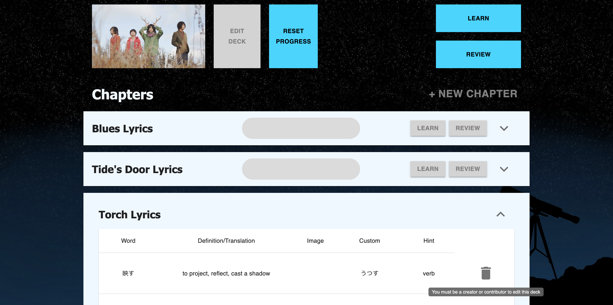

Users can only edit flashcard decks they own. Inaccesible options are grayed out for the user, and uneditable items are shown in view-mode only.
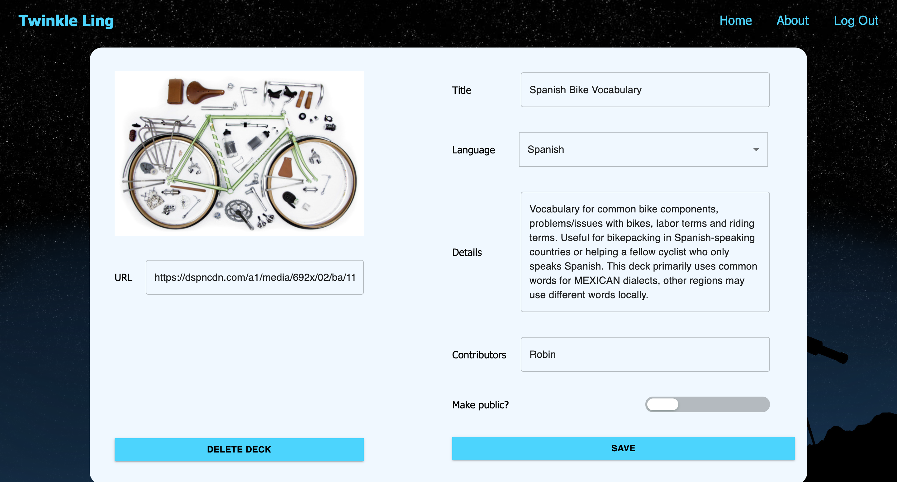
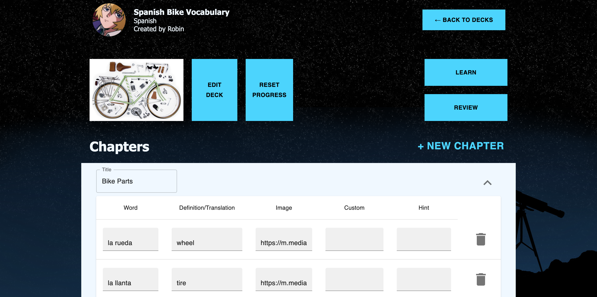

### Study
Users can edit their study settings to choose prompt options, answer options, and number of words per session.
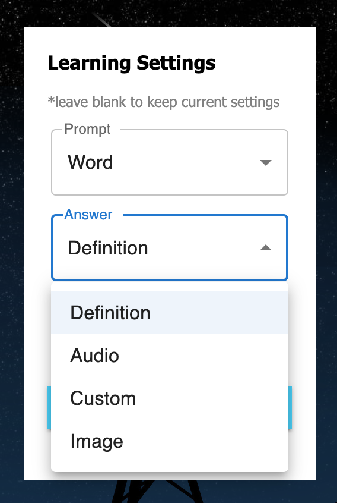  

Users can enter a study session by:
<ul>
  <li>Clicking "Quick Study" on the chosen deck on their dashboard or deck list, which defaults to a review session of all words in that deck, or a learning session if no words have been learned by the user.</li>

  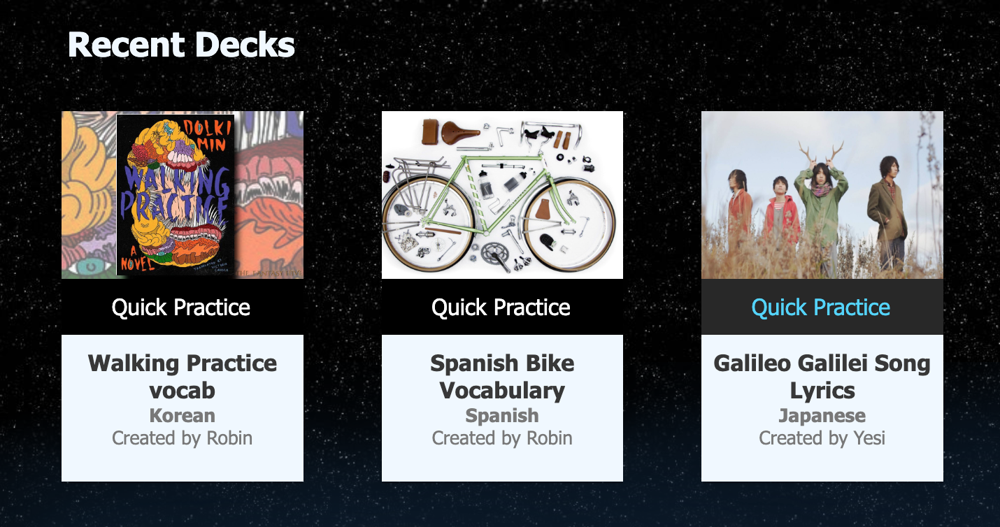

  <li>Clicking "learn" or "review" from the deck's details page, which begins a session with only new words, or a session with only previously learned words, respectively. Each option can be chosen only if it is available for the deck.</li>

  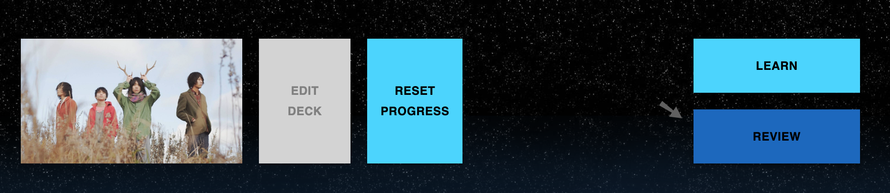

  <li>Clicking "learn" or "review" from an individual chapter from a deck's details page to only learn or review the words in the selected chapter. Each option can be chosen only if it is available for the chapter.</li>

  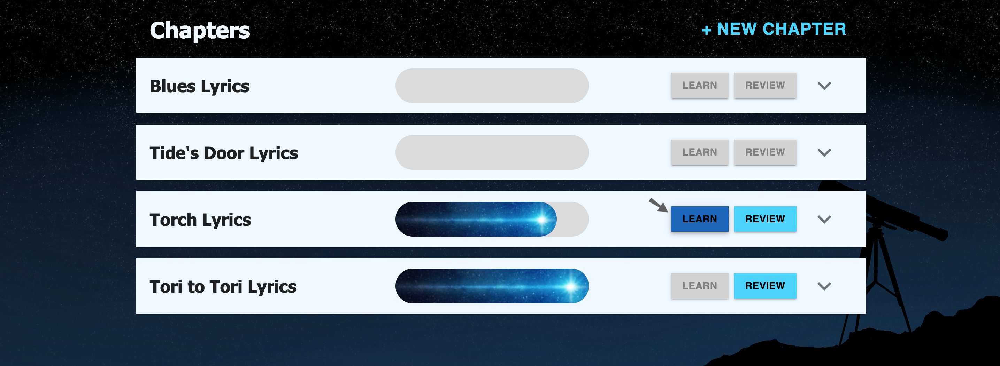
</ul> 

During a study session, each word will be presented in the user's chosen prompt type, and 6 randomized answer options (chosen from the same deck) are presented beneath it. There is a counter on the top right to record how many correct guesses and mistakes the user makes. There is a progress bar at the top to show the user how far they are in the session, and it automatically updates when they make a correct guess. Sessions do not end until every prompt is answered correctly.
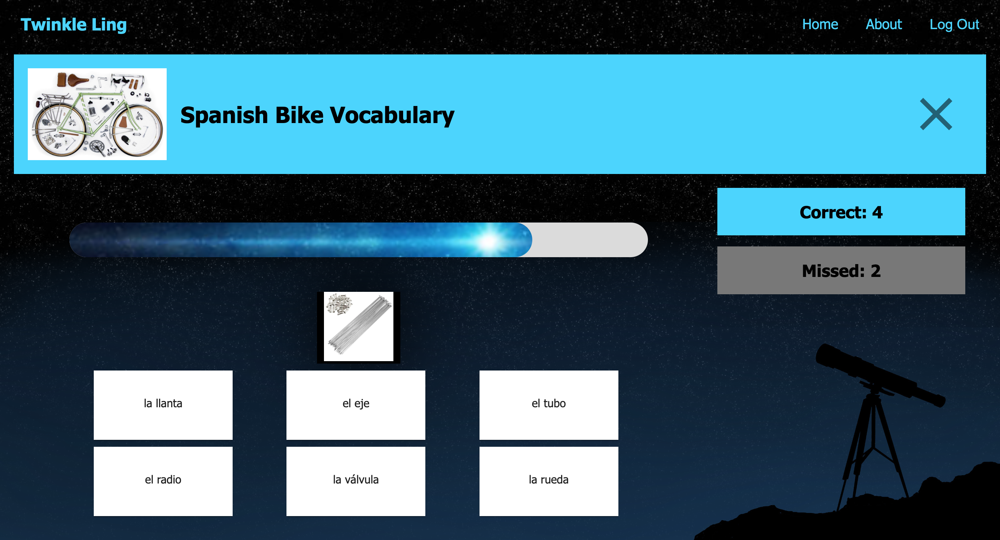 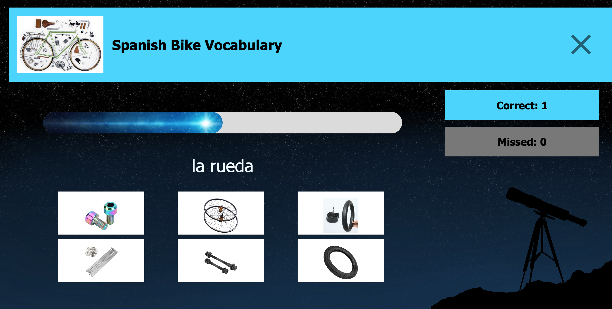

If a study session is ended prematurely, all session progress is saved but no session summary is shown, and the user is redirected to details page for that deck.

When a session is finished, the user can view their session summary and edit their study settings before the next session.
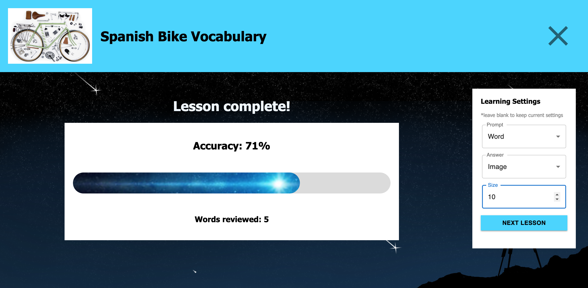

### Sharing
Deck sharing feature coming soon.
